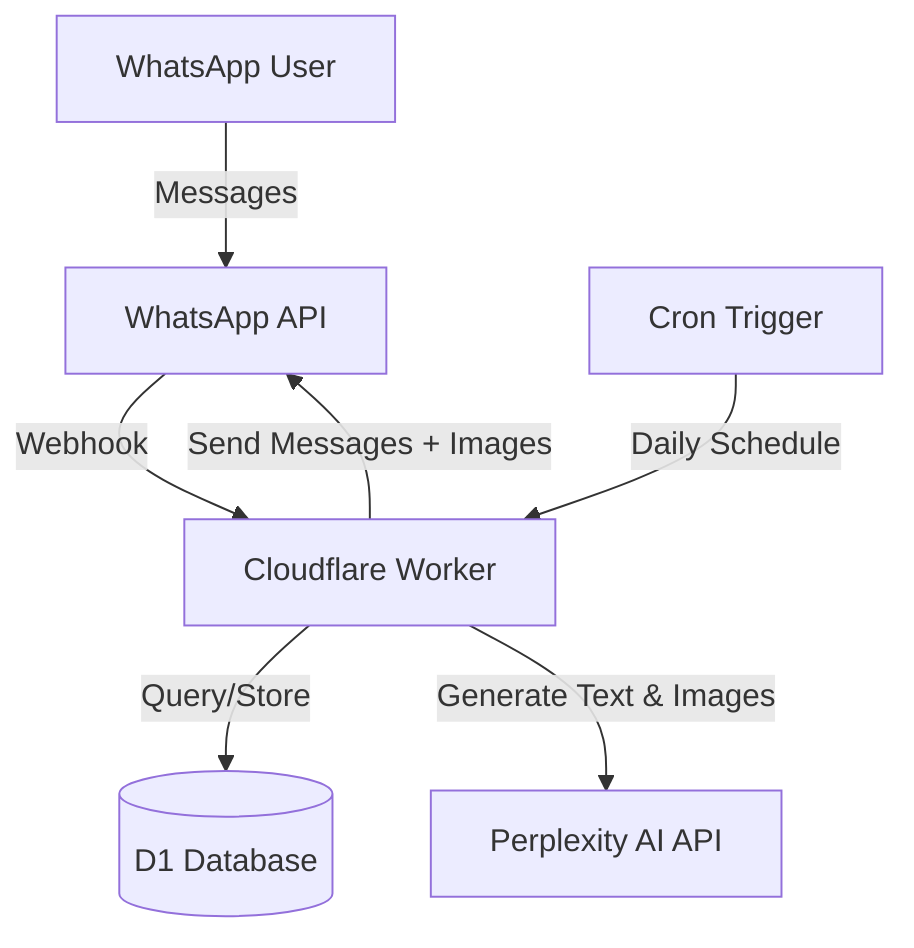

# Design Document

## Overview

The Daily Painting Bot is a serverless WhatsApp bot built on Cloudflare Workers using Node.js and Wrangler. The system delivers personalized painting prompts to users every morning, with prompts generated by Perplexity AI and tailored to three skill levels: beginner, intermediate, and advanced. The architecture leverages Cloudflare's edge computing platform for low-latency message handling and D1 SQL database for persistent user data storage.

## Architecture

### High-Level Architecture

The system follows a serverless event-driven architecture with three primary execution paths:

1. **Webhook Handler**: Processes incoming WhatsApp messages via HTTP requests
2. **Cron Handler**: Executes scheduled daily prompt delivery
3. **API Integration Layer**: Manages external service communication (Perplexity AI, WhatsApp API)



### Technology Stack

- **Runtime**: Node.js on Cloudflare Workers
- **Build Tool**: Wrangler CLI
- **Database**: Cloudflare D1 (SQLite-based)
- **External APIs**:
  - WhatsApp Business API (or WhatsApp Cloud API)
  - Perplexity AI API (for both text and image generation)
- **Scheduling**: Cloudflare Workers Cron Triggers

## Components and Interfaces

### 1. Message Handler Component

Processes incoming WhatsApp webhook events and routes commands to appropriate handlers.

**Interface:**
```typescript
interface MessageHandler {
  handleIncomingMessage(request: Request): Promise<Response>;
  parseCommand(message: string): Command;
  routeCommand(command: Command, userId: string): Promise<string>;
}

type Command =
  | { type: 'subscribe'; skillLevel?: SkillLevel; language?: Language }
  | { type: 'update_skill'; skillLevel?: SkillLevel }
  | { type: 'update_language'; language?: Language }
  | { type: 'unsubscribe' }
  | { type: 'get_prompt' }
  | { type: 'help' }
  | { type: 'unknown'; text: string };

type SkillLevel = 'beginner' | 'intermediate' | 'advanced';
type Language = 'ro' | 'en' | 'es' | 'fr' | 'de' | 'it' | 'pt' | 'ja' | 'zh' | 'ar' | 'hi';
```

### 2. User Repository Component

Manages user subscription data in D1 Database.

**Interface:**
```typescript
interface UserRepository {
  createUser(phoneNumber: string, skillLevel: SkillLevel, language: Language): Promise<User>;
  getUser(phoneNumber: string): Promise<User | null>;
  updateSkillLevel(phoneNumber: string, skillLevel: SkillLevel): Promise<void>;
  updateLanguage(phoneNumber: string, language: Language): Promise<void>;
  deleteUser(phoneNumber: string): Promise<void>;
  getAllActiveUsers(): Promise<User[]>;
  getUsersBySkillLevel(skillLevel: SkillLevel): Promise<User[]>;
  getUsersBySkillAndLanguage(skillLevel: SkillLevel, language: Language): Promise<User[]>;
}

interface User {
  phoneNumber: string;
  skillLevel: SkillLevel;
  language: Language;
  subscribedAt: Date;
  lastPromptSent: Date | null;
  isActive: boolean;
}
```

### 3. Prompt Generator Component

Generates painting prompts using Perplexity AI with skill-level-specific context.

**Interface:**
```typescript
interface PromptGenerator {
  generatePrompt(skillLevel: SkillLevel, language: Language): Promise<PaintingPrompt>;
  generatePromptWithRetry(skillLevel: SkillLevel, language: Language, maxRetries: number): Promise<PaintingPrompt>;
  getFallbackPrompt(skillLevel: SkillLevel, language: Language): PaintingPrompt;
}

interface PaintingPrompt {
  text: string;
  imageUrl: string;
  skillLevel: SkillLevel;
  language: Language;
}

interface PerplexityClient {
  query(prompt: string, context: string): Promise<string>;
}
```

### 3a. Image Generator Component

Generates inspiration images using Perplexity AI's image generation capabilities.

**Interface:**
```typescript
interface ImageGenerator {
  generateImage(promptText: string, skillLevel: SkillLevel, language: Language): Promise<string>;
  generateImageWithRetry(promptText: string, skillLevel: SkillLevel, language: Language, maxRetries: number): Promise<string>;
  getFallbackImageUrl(skillLevel: SkillLevel, language: Language): string;
}

interface PerplexityImageClient {
  generateImage(prompt: string): Promise<ImageResult>;
}

interface ImageResult {
  url: string;
}
```

### 4. WhatsApp Client Component

Handles communication with WhatsApp API for sending messages with text and images.

**Interface:**
```typescript
interface WhatsAppClient {
  sendMessage(phoneNumber: string, message: string): Promise<SendResult>;
  sendMessageWithImage(phoneNumber: string, message: string, imageUrl: string): Promise<SendResult>;
  sendBulkMessages(messages: Array<{ phoneNumber: string; message: string; imageUrl?: string }>): Promise<BulkSendResult>;
}

interface SendResult {
  success: boolean;
  messageId?: string;
  error?: string;
}

interface BulkSendResult {
  totalSent: number;
  totalFailed: number;
  failures: Array<{ phoneNumber: string; error: string }>;
}
```

### 5. Scheduler Component

Orchestrates daily prompt delivery to all active users.

**Interface:**
```typescript
interface Scheduler {
  executeDailyDelivery(): Promise<DeliveryReport>;
  generatePromptsForAllCombinations(): Promise<Map<string, PaintingPrompt>>; // key: "skillLevel-language"
  sendPromptsToUsers(prompts: Map<string, PaintingPrompt>): Promise<DeliveryReport>;
}

interface DeliveryReport {
  timestamp: Date;
  totalUsers: number;
  successCount: number;
  failureCount: number;
  promptsGenerated: number;
  imagesGenerated: number;
  apiUsage: {
    perplexityTokens: number;
    imageGenerations: number;
    whatsappMessages: number;
  };
}
```

## Data Models

### Database Schema

```sql
-- Users table
CREATE TABLE users (
  phone_number TEXT PRIMARY KEY,
  skill_level TEXT NOT NULL CHECK(skill_level IN ('beginner', 'intermediate', 'advanced')),
  language TEXT NOT NULL CHECK(language IN ('ro', 'en', 'es', 'fr', 'de', 'it', 'pt', 'ja', 'zh', 'ar', 'hi')) DEFAULT 'ro',
  subscribed_at DATETIME NOT NULL DEFAULT CURRENT_TIMESTAMP,
  last_prompt_sent DATETIME,
  is_active INTEGER NOT NULL DEFAULT 1,
  created_at DATETIME NOT NULL DEFAULT CURRENT_TIMESTAMP,
  updated_at DATETIME NOT NULL DEFAULT CURRENT_TIMESTAMP
);

CREATE INDEX idx_users_skill_level ON users(skill_level) WHERE is_active = 1;
CREATE INDEX idx_users_language ON users(language) WHERE is_active = 1;
CREATE INDEX idx_users_skill_language ON users(skill_level, language) WHERE is_active = 1;
CREATE INDEX idx_users_active ON users(is_active);

-- API usage logs table
CREATE TABLE api_usage_logs (
  id INTEGER PRIMARY KEY AUTOINCREMENT,
  timestamp DATETIME NOT NULL DEFAULT CURRENT_TIMESTAMP,
  service TEXT NOT NULL CHECK(service IN ('perplexity', 'whatsapp', 'image_generation')),
  operation TEXT NOT NULL,
  tokens_used INTEGER,
  messages_sent INTEGER,
  images_generated INTEGER,
  success INTEGER NOT NULL,
  error_message TEXT
);

CREATE INDEX idx_api_usage_timestamp ON api_usage_logs(timestamp);
CREATE INDEX idx_api_usage_service ON api_usage_logs(service);

-- Delivery logs table
CREATE TABLE delivery_logs (
  id INTEGER PRIMARY KEY AUTOINCREMENT,
  timestamp DATETIME NOT NULL DEFAULT CURRENT_TIMESTAMP,
  total_users INTEGER NOT NULL,
  success_count INTEGER NOT NULL,
  failure_count INTEGER NOT NULL,
  prompts_generated INTEGER NOT NULL,
  images_generated INTEGER NOT NULL,
  execution_time_ms INTEGER NOT NULL
);
```

### Configuration Model

```typescript
interface BotConfig {
  whatsapp: {
    apiUrl: string;
    apiToken: string;
    phoneNumberId: string;
  };
  perplexity: {
    apiUrl: string;
    apiKey: string;
    textModel: string;
    imageModel: string;
    maxTokens: number;
  };
  scheduling: {
    cronExpression: string;
    timezone: string;
  };
  prompts: {
    maxRetries: number;
    retryDelayMs: number;
    fallbackPrompts: Record<string, { text: string; imageUrl: string }[]>; // key: "skillLevel-language"
  };
  supportedLanguages: Language[];
}
```

## Correctness Properties

*A property is a characteristic or behavior that should hold true across all valid executions of a system-essentially, a formal statement about what the system should do. Properties serve as the bridge between human-readable specifications and machine-verifiable correctness guarantees.*


### Property Reflection

After analyzing all acceptance criteria, several properties can be consolidated to eliminate redundancy:
- Subscription flow properties (1.1, 1.2, 1.4) combined into a single end-to-end property
- Update flow properties (2.1, 2.2, 2.3) combined into a single update property
- Unsubscribe flow properties (3.1, 3.2) combined into a single unsubscribe property
- On-demand prompt properties (6.1, 6.2) combined into a single request-response property
- Logging properties (10.1, 10.2, 10.3) combined into comprehensive logging property

This reduces overlap while maintaining complete coverage of functional requirements.

### Correctness Properties

Property 1: Subscription creates persistent user record with language
*For any* valid phone number, skill level, and language, when a user subscribes, the system should store the user record with all preferences in the database, return a welcome confirmation message in the user's language, and the user should appear in the active users list.
**Validates: Requirements 1.1, 1.2, 1.4, 2.1, 2.2**

Property 2: Subscription is idempotent
*For any* user who is already subscribed, attempting to subscribe again should return their current subscription status without creating duplicate records.
**Validates: Requirements 1.3**

Property 3: Skill level update modifies user record
*For any* subscribed user with skill level A, updating to skill level B should result in the database reflecting skill level B and return a confirmation message in the user's language.
**Validates: Requirements 3.1, 3.2, 3.3**

Property 3a: Language update modifies user record
*For any* subscribed user with language A, updating to language B should result in the database reflecting language B and return a confirmation message in the new language.
**Validates: Requirements 2.5**

Property 4: Unsubscription deactivates user
*For any* active user, unsubscribing should mark them as inactive in the database, remove them from the active users list, and return a confirmation message in the user's language.
**Validates: Requirements 4.1, 4.2**

Property 5: Unsubscribed users excluded from scheduled delivery
*For any* user marked as inactive, they should not receive scheduled painting prompts during daily delivery runs.
**Validates: Requirements 4.3**

Property 6: Prompt generation includes skill level and language context
*For any* skill level and language, when generating a prompt, the request to Perplexity AI should include both the skill level and language in the context parameters.
**Validates: Requirements 2.3, 5.1**

Property 7: Prompt extraction succeeds for valid responses
*For any* valid Perplexity AI response, the system should successfully extract a non-empty painting idea string in the requested language.
**Validates: Requirements 2.4, 5.2**

Property 8: API failures trigger retry with exponential backoff
*For any* Perplexity API request that fails, the system should retry exactly 3 times with exponentially increasing delays between attempts.
**Validates: Requirements 5.3**

Property 9: Exhausted retries use fallback prompts
*For any* prompt generation where all retry attempts fail, the system should return a fallback prompt in the appropriate language from the predefined list rather than failing completely.
**Validates: Requirements 5.4**

Property 10: Scheduled delivery retrieves all active users
*For any* scheduled delivery execution, the system should retrieve all and only users where is_active = 1 from the database.
**Validates: Requirements 6.1**

Property 11: One prompt generated per skill level and language combination
*For any* scheduled delivery run with active users, the system should generate exactly one prompt for each unique combination of skill level and language present in the active user base.
**Validates: Requirements 6.2**

Property 12: Users with same skill level and language receive same prompt
*For any* skill level and language combination and its generated prompt during scheduled delivery, all active users with that skill level and language should receive identical prompt text and image.
**Validates: Requirements 6.3**

Property 13: Message failures don't halt processing
*For any* scheduled delivery where one or more messages fail to send, the system should continue processing all remaining users rather than stopping.
**Validates: Requirements 6.4**

Property 14: Delivery completion generates accurate logs
*For any* completed scheduled delivery, a log entry should be created with accurate counts of total users, successful sends, and failed sends.
**Validates: Requirements 6.5**

Property 15: On-demand prompt request generates and delivers immediately in user's language
*For any* subscribed user requesting a prompt, the system should generate a new prompt based on their skill level and language preference and send it immediately in the response.
**Validates: Requirements 2.4, 7.1, 7.2**

Property 16: Unsubscribed users cannot request prompts
*For any* user not in the active subscription list, requesting a prompt should return a message indicating subscription is required in the appropriate language.
**Validates: Requirements 7.3**

Property 17: Unknown commands return helpful guidance in user's language
*For any* message that doesn't match recognized command patterns, the system should respond with a message in the user's preferred language suggesting the help command.
**Validates: Requirements 2.4, 8.2**

Property 18: SQL injection attempts are neutralized
*For any* user input containing SQL injection patterns (e.g., phone numbers with SQL syntax), the system should treat it as literal data and not execute it as SQL code.
**Validates: Requirements 10.1**

Property 19: User deletion removes all data
*For any* user record, calling the delete operation should result in that phone number no longer existing in the database.
**Validates: Requirements 10.3**

Property 20: API calls generate usage logs
*For any* API call to Perplexity AI or WhatsApp API, a log entry should be created with timestamp, service name, operation details, and success/failure status.
**Validates: Requirements 11.1, 11.2, 11.3**

Property 21: Prompts include both text and image in correct language
*For any* generated painting prompt for a given language, the result should contain both non-empty text content in that language and a valid image URL.
**Validates: Requirements 2.3, 5.1, 5.2**

Property 22: Image generation failures use fallback images
*For any* image generation where all retry attempts fail, the system should return a fallback image URL from the predefined list rather than failing completely.
**Validates: Requirements 5.4**

Property 23: WhatsApp messages include images and text in user's language
*For any* painting prompt sent via WhatsApp, the message should include both the text prompt in the user's preferred language and the associated image.
**Validates: Requirements 2.4, 6.3, 7.2**

## Internationalization Strategy

### Supported Languages

The bot will support the following languages:
- Romanian (ro) - Default
- English (en)
- Spanish (es)
- French (fr)
- German (de)
- Italian (it)
- Portuguese (pt)
- Japanese (ja)
- Chinese (zh)
- Arabic (ar)
- Hindi (hi)

### Language Detection and Selection

1. **During Subscription**: Users are prompted to select their preferred language
2. **Language Update**: Users can change their language preference at any time using an update command
3. **Default Language**: If no language is specified, default to Romanian (ro)

### Localized Content

1. **Bot Messages**: All system messages (welcome, confirmations, errors, help) must be available in all supported languages
2. **Painting Prompts**: Perplexity AI generates prompts in the user's preferred language by including language context in the API request
3. **Command Recognition**: Commands should be recognized in multiple languages (e.g., "help", "ayuda", "aide", "hilfe")

### Implementation Approach

1. **Message Templates**: Store message templates in a structured format with translations for each supported language
2. **Language Context**: Always pass the user's language preference to Perplexity AI when generating prompts
3. **Fallback Prompts**: Maintain fallback prompts in all supported languages for each skill level

### Translation Management

- Use a simple key-value structure for bot messages
- Example structure:
```typescript
const messages = {
  welcome: {
    ro: "Bine ai venit la Bot-ul de Pictură Zilnică!",
    en: "Welcome to Daily Painting Bot!",
    es: "¡Bienvenido al Bot de Pintura Diaria!",
    fr: "Bienvenue au Bot de Peinture Quotidienne!",
    // ... other languages
  },
  // ... other messages
};
```

## Image Generation Strategy

### Approach

The system generates inspiration images using Perplexity AI to accompany each painting prompt, providing users with visual reference and motivation. Perplexity AI can generate images directly through its API, eliminating the need for a separate image generation service.

### Image Generation Flow

1. **Text Prompt Generated**: Perplexity AI creates the painting idea text
2. **Extract Visual Keywords**: Parse the text to identify key subjects, styles, and techniques
3. **Generate Image Prompt**: Create a concise image generation prompt (e.g., "simple starry night sky with stars and moon, beginner-friendly painting reference, artistic style")
4. **Call Perplexity Image API**: Request image generation using Perplexity's image generation endpoint
5. **Retry on Failure**: Use exponential backoff (3 attempts) if generation fails
6. **Use Fallback**: If all attempts fail, select a fallback image URL for that skill level

### Skill-Appropriate Styling

Apply different artistic styles in the image generation prompt based on skill level:
- **Beginner**: "simple, clear, basic composition, easy to follow"
- **Intermediate**: "moderate complexity, interesting techniques, artistic"
- **Advanced**: "sophisticated, complex composition, conceptual, artistic mastery"

### Image Hosting

- Perplexity-generated images provide URLs that can be sent directly via WhatsApp
- Fallback images should be hosted on reliable CDN (e.g., Cloudflare R2, Cloudinary)
- Consider caching generated image URLs in the database to avoid regeneration

## Error Handling

### API Error Handling

1. **Perplexity AI Failures**
   - Implement exponential backoff retry strategy (3 attempts)
   - Retry delays: 1s, 2s, 4s
   - After exhausting retries, use fallback prompts
   - Log all failures with error details

2. **Image Generation Failures**
   - Implement exponential backoff retry strategy (3 attempts)
   - Retry delays: 1s, 2s, 4s
   - After exhausting retries, use fallback image URLs
   - Log all failures with error details
   - Ensure fallback images are always accessible

3. **WhatsApp API Failures**
   - Individual message failures should not stop batch processing
   - Log failed messages with phone number and error
   - Return partial success in bulk operations
   - No automatic retry for message delivery (to avoid duplicates)

3. **Database Errors**
   - Wrap all database operations in try-catch blocks
   - Return appropriate error responses to users
   - Log database errors with query context
   - Use transactions for multi-step operations

### Input Validation

1. **Phone Number Validation**
   - Validate format before database operations
   - Sanitize input to prevent SQL injection
   - Return clear error messages for invalid formats

2. **Skill Level Validation**
   - Validate against allowed values: 'beginner', 'intermediate', 'advanced'
   - Provide clear options when invalid level is provided
   - Default to prompting for selection if ambiguous

3. **Command Parsing**
   - Handle case-insensitive commands
   - Provide helpful suggestions for typos
   - Return help information for unrecognized commands

### Rate Limiting and Quotas

1. **API Rate Limits**
   - Track API usage to stay within quotas
   - Implement graceful degradation if limits approached
   - Alert administrators when approaching limits

2. **User Rate Limiting**
   - Limit on-demand prompt requests (e.g., max 5 per day per user)
   - Prevent spam by tracking request frequency
   - Return friendly message when limit exceeded

## Deployment and Configuration

### Environment Variables

Required secrets and configuration (stored in Cloudflare Workers secrets):
- `WHATSAPP_API_TOKEN`: Authentication token for WhatsApp API
- `WHATSAPP_PHONE_NUMBER_ID`: WhatsApp Business phone number ID
- `PERPLEXITY_API_KEY`: API key for Perplexity AI (used for both text and image generation)
- `WEBHOOK_VERIFY_TOKEN`: Token for WhatsApp webhook verification

### Wrangler Configuration

```toml
name = "daily-painting-bot"
main = "src/index.ts"
compatibility_date = "2024-01-01"

[triggers]
crons = ["0 8 * * *"]  # Daily at 8:00 AM UTC

[[d1_databases]]
binding = "DB"
database_name = "painting_bot_db"
database_id = "<database-id>"

[vars]
PERPLEXITY_API_URL = "https://api.perplexity.ai"
PERPLEXITY_TEXT_MODEL = "llama-3.1-sonar-small-128k-online"
PERPLEXITY_IMAGE_MODEL = "playground-v2.5"
WHATSAPP_API_URL = "https://graph.facebook.com/v18.0"
MAX_RETRIES = "3"
RETRY_DELAY_MS = "1000"
```

### Database Migrations

Database schema will be managed through Wrangler's D1 migration system:
- Initial migration creates users, api_usage_logs, and delivery_logs tables
- Migrations are versioned and applied automatically during deployment
- Rollback capability for schema changes

### Monitoring and Observability

1. **Logging**
   - Structured logging with consistent format
   - Log levels: ERROR, WARN, INFO, DEBUG
   - Include request IDs for tracing

2. **Metrics**
   - Track daily delivery success rate
   - Monitor API response times
   - Track user growth and churn
   - Monitor API quota usage

3. **Alerts**
   - Alert on delivery failure rate > 10%
   - Alert on API quota approaching limit
   - Alert on database errors

## Security Considerations

1. **API Security**
   - Store all API keys in Cloudflare Workers secrets
   - Verify WhatsApp webhook signatures
   - Use HTTPS for all external API calls

2. **Data Privacy**
   - Store only necessary user data (phone number, skill level)
   - Implement data deletion on unsubscribe
   - Comply with data retention policies

3. **Input Sanitization**
   - Use parameterized queries for all database operations
   - Validate and sanitize all user inputs
   - Implement rate limiting to prevent abuse

4. **Access Control**
   - Restrict database access to Worker bindings only
   - Use principle of least privilege for API permissions
   - Implement proper error messages that don't leak sensitive info
