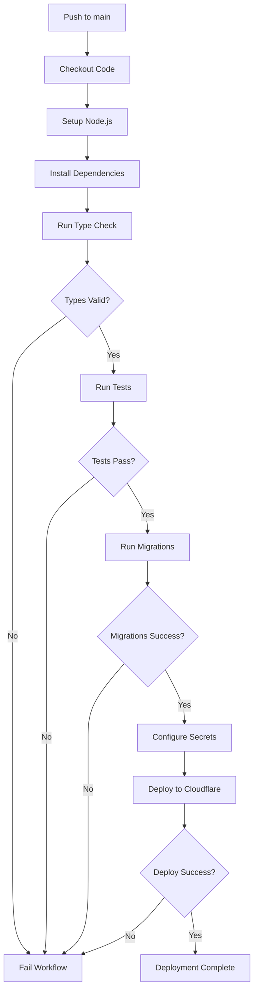

# Design Document: GitHub Actions Deployment

## Overview

This design implements an automated CI/CD pipeline using GitHub Actions to deploy the Daily Painting Bot to Cloudflare Workers. The system will validate code quality, run tests, execute database migrations, and deploy the application whenever changes are pushed to the main branch. All sensitive credentials will be managed through GitHub Secrets and securely passed to Cloudflare.

## Architecture

### Workflow Trigger
- **Event**: Push to `main` branch
- **Runner**: Ubuntu latest (GitHub-hosted)
- **Concurrency**: Single deployment at a time (prevents race conditions)

### Pipeline Stages

1. **Checkout**: Clone the repository code
2. **Setup**: Install Node.js and dependencies
3. **Validate**: Run type checking and tests
4. **Migrate**: Execute D1 database migrations
5. **Configure Secrets**: Set application secrets in Cloudflare
6. **Deploy**: Deploy the Worker using Wrangler

### Secret Management Flow

```
GitHub Secrets → GitHub Actions Environment → Wrangler CLI → Cloudflare Workers
```

GitHub Secrets are injected as environment variables during workflow execution and used by Wrangler to authenticate with Cloudflare and configure Worker secrets.

## Components and Interfaces

### GitHub Actions Workflow File

**Location**: `.github/workflows/deploy.yml`

**Key Sections**:
- `name`: Workflow identifier
- `on`: Trigger configuration (push to main)
- `concurrency`: Prevents concurrent deployments
- `jobs`: Deployment job definition
- `steps`: Sequential deployment steps

### Required GitHub Secrets

| Secret Name | Purpose | Used By |
|------------|---------|---------|
| `CLOUDFLARE_API_TOKEN` | Authenticates with Cloudflare API | Wrangler CLI |
| `CLOUDFLARE_ACCOUNT_ID` | Identifies the Cloudflare account | Wrangler CLI |
| `CLOUDFLARE_DATABASE_ID` | D1 database identifier | Wrangler CLI |
| `CLOUDFLARE_DATABASE_NAME` | D1 database name | Wrangler CLI |
| `WHATSAPP_API_TOKEN` | WhatsApp Business API access | Worker runtime |
| `WHATSAPP_PHONE_NUMBER_ID` | WhatsApp phone number identifier | Worker runtime |
| `PERPLEXITY_API_KEY` | Perplexity AI API authentication | Worker runtime |
| `WEBHOOK_VERIFY_TOKEN` | WhatsApp webhook verification | Worker runtime |

### Wrangler Commands

1. **Authentication**: Implicit via `CLOUDFLARE_API_TOKEN` environment variable
2. **Configuration Update**: Update `wrangler.toml` with database ID from secrets
3. **Migration**: `wrangler d1 migrations apply painting_bot_db --remote`
4. **Secret Configuration**: `wrangler secret put <SECRET_NAME>`
5. **Deployment**: `wrangler deploy`

### Environment Variables

The workflow will set these environment variables for Wrangler:
- `CLOUDFLARE_API_TOKEN`: For API authentication
- `CLOUDFLARE_ACCOUNT_ID`: For account identification

### Dynamic Configuration

The workflow will dynamically generate `wrangler.toml` from a template before deployment:
- Use `wrangler.toml.example` as a template (tracked in git)
- Replace `{{DATABASE_NAME}}` placeholder with value from `CLOUDFLARE_DATABASE_NAME` secret
- Replace `{{DATABASE_ID}}` placeholder with value from `CLOUDFLARE_DATABASE_ID` secret
- Generate the actual `wrangler.toml` file (not tracked in git)
- This ensures sensitive database identifiers are never committed to the repository

**File Strategy**:
- `wrangler.toml.example` - Template file (tracked in git, contains placeholders)
- `wrangler.toml` - Actual config file (gitignored, generated dynamically)
- For local development, developers copy the example and fill in their own values

## Data Models

### Workflow Configuration

```yaml
name: string                    # Workflow name
on:
  push:
    branches: string[]          # Trigger branches
concurrency:
  group: string                 # Concurrency group identifier
  cancel-in-progress: boolean   # Cancel running workflows
jobs:
  deploy:
    runs-on: string             # Runner type
    steps: Step[]               # Deployment steps
```

### Step Definition

```yaml
name: string                    # Step name
uses?: string                   # Action to use (for marketplace actions)
run?: string                    # Shell command to execute
with?: object                   # Action inputs
env?: object                    # Environment variables
```

##
Correctness Properties

*A property is a characteristic or behavior that should hold true across all valid executions of a system-essentially, a formal statement about what the system should do. Properties serve as the bridge between human-readable specifications and machine-verifiable correctness guarantees.*

After analyzing the acceptance criteria, most of the requirements relate to configuration validation (checking that the workflow YAML is correctly structured) and platform behaviors (GitHub Actions' built-in features). Since this is primarily a configuration-based system rather than algorithmic code, the correctness properties focus on validating the configuration artifacts.

**Configuration Validation Properties:**

Property 1: Workflow trigger configuration
*For the* workflow configuration file, the trigger configuration should specify 'main' in the push branches array
**Validates: Requirements 1.1**

Property 2: Required secrets reference
*For the* workflow configuration file, all required secrets (CLOUDFLARE_API_TOKEN, CLOUDFLARE_ACCOUNT_ID, CLOUDFLARE_DATABASE_ID, WHATSAPP_API_TOKEN, WHATSAPP_PHONE_NUMBER_ID, PERPLEXITY_API_KEY, WEBHOOK_VERIFY_TOKEN) should be referenced using the secrets context
**Validates: Requirements 2.1, 2.2, 3.1, 3.2, 3.3, 3.4**

Property 3: Step ordering
*For the* workflow configuration file, the migration step should appear before the deployment step in the steps array
**Validates: Requirements 4.1**

Property 4: Validation steps presence
*For the* workflow configuration file, type checking and test execution steps should be present before the deployment step
**Validates: Requirements 6.1, 6.3**

Property 5: Documentation completeness
*For the* deployment documentation file, all required secrets should be documented with setup instructions
**Validates: Requirements 7.1, 7.2, 7.3, 7.4**

**Note on Testing Approach:**

Since this feature is primarily configuration-based (YAML files and documentation), traditional property-based testing with random input generation is not applicable. Instead, validation will focus on:
- Static analysis of the workflow YAML structure
- Verification that required elements are present and correctly ordered
- Documentation completeness checks

The GitHub Actions platform itself handles most runtime behaviors (error reporting, logging, secret masking), so those aspects don't require custom testing.

## Error Handling

### Workflow-Level Error Handling

1. **Step Failures**: Each step should fail fast if errors occur (default GitHub Actions behavior)
2. **Secret Access Errors**: If secrets are not configured, Wrangler will fail with authentication errors
3. **Migration Failures**: Database migration errors will halt deployment before the Worker is updated
4. **Deployment Failures**: Wrangler will report deployment errors with detailed messages

### Error Scenarios

| Scenario | Detection | Resolution |
|----------|-----------|------------|
| Missing GitHub Secret | Wrangler authentication failure | Add secret in GitHub repository settings |
| Invalid API Token | Cloudflare API error | Regenerate and update token |
| Migration Failure | D1 migration error | Review migration SQL and database state |
| Type Check Failure | TypeScript compiler error | Fix type errors in code |
| Test Failure | Test runner exit code | Fix failing tests |
| Deployment Failure | Wrangler error | Check Wrangler logs and Worker configuration |

### Logging Strategy

- All steps log to GitHub Actions console automatically
- Wrangler provides detailed deployment logs
- Failed steps show error messages and exit codes
- Secrets are automatically masked in logs by GitHub Actions

## Testing Strategy

### Configuration Validation

Since this feature is primarily configuration-based, testing will focus on validating the structure and content of configuration files:

**Workflow YAML Validation**:
- Verify the workflow file is valid YAML
- Check that all required steps are present
- Verify step ordering (validation → migration → deployment)
- Confirm all required secrets are referenced
- Validate trigger configuration

**Documentation Validation**:
- Verify all required secrets are documented
- Check that setup instructions are present
- Confirm troubleshooting section exists

### Integration Testing

**Manual Testing Checklist**:
1. Push to main branch and verify workflow triggers
2. Check that all steps execute in correct order
3. Verify deployment succeeds with valid secrets
4. Test failure scenarios (invalid secrets, failing tests)
5. Confirm Worker is accessible after deployment

**Automated Testing**:
- YAML linting using `yamllint` or similar tools
- Schema validation for GitHub Actions workflow syntax
- Documentation link checking

### Property-Based Testing

Given the configuration-based nature of this feature, traditional property-based testing with random input generation is not applicable. The "properties" defined above are more accurately described as configuration invariants that should be validated through static analysis rather than runtime testing.

**Testing Framework**: Not applicable for this feature (configuration validation only)

### Unit Testing

Unit tests are not applicable for this feature as it consists entirely of configuration files (YAML) and documentation (Markdown). Validation will be performed through:
- YAML syntax validation
- Schema validation against GitHub Actions workflow schema
- Manual verification of deployment process

## Implementation Notes

### Wrangler Secret Management

Wrangler provides two methods for setting secrets:
1. **Interactive**: `wrangler secret put SECRET_NAME` (prompts for value)
2. **Piped**: `echo "value" | wrangler secret put SECRET_NAME`

The workflow will use the piped method to set secrets non-interactively:

```bash
echo "${{ secrets.WHATSAPP_API_TOKEN }}" | wrangler secret put WHATSAPP_API_TOKEN
```

### Concurrency Control

The workflow uses concurrency groups to prevent multiple deployments from running simultaneously:

```yaml
concurrency:
  group: production-deployment
  cancel-in-progress: true
```

This ensures that if a new push occurs while a deployment is running, the old deployment is immediately cancelled and the new deployment starts right away. This guarantees that only the latest code is deployed, preventing outdated deployments from completing after newer code has been pushed.

### Database Configuration Strategy

Before running migrations or deploying, the workflow must generate `wrangler.toml` from the template:

```bash
# Generate wrangler.toml from template with actual values from secrets
sed -e "s/{{DATABASE_NAME}}/$CLOUDFLARE_DATABASE_NAME/g" \
    -e "s/{{DATABASE_ID}}/$CLOUDFLARE_DATABASE_ID/g" \
    wrangler.toml.example > wrangler.toml
```

This approach keeps sensitive database identifiers completely out of version control while allowing the workflow to use them dynamically.

**Local Development Setup**:
Developers should copy the template and fill in their own values:
```bash
cp wrangler.toml.example wrangler.toml
# Edit wrangler.toml with actual database_name and database_id
```

### Database Migration Strategy

Migrations run with the `--remote` flag to target the production D1 database:

```bash
wrangler d1 migrations apply painting_bot_db --remote
```

**Migration Idempotency Requirements**:
- Migrations must be idempotent - running them multiple times should be safe
- Use `CREATE TABLE IF NOT EXISTS` to handle cases where tables don't exist
- Use `CREATE INDEX IF NOT EXISTS` for index creation
- Use `ALTER TABLE` with conditional checks for schema changes
- Wrangler tracks which migrations have been applied, preventing duplicate execution
- First deployment will create all tables; subsequent deployments will only apply new migrations

**Note**: The existing migration file (`0001_initial_schema.sql`) should be updated to use `IF NOT EXISTS` clauses to ensure idempotency. This is important for the automated deployment workflow to handle both initial deployments and updates gracefully.

### Environment Variable Precedence

Wrangler authentication uses environment variables:
- `CLOUDFLARE_API_TOKEN`: API token for authentication
- `CLOUDFLARE_ACCOUNT_ID`: Account identifier

These are set in the workflow environment and automatically used by Wrangler.

## Deployment Workflow Diagram



## Security Considerations

1. **Secret Storage**: All sensitive values stored in GitHub Secrets (encrypted at rest)
2. **Secret Masking**: GitHub Actions automatically masks secret values in logs
3. **Least Privilege**: Cloudflare API token should have minimal required permissions
4. **No Secret Commits**: Workflow never writes secrets to files or commits them
5. **Audit Trail**: All deployments logged in GitHub Actions history

## Documentation Updates Required

The following documentation files need to be created or updated:

1. **New File**: `.github/workflows/deploy.yml` - GitHub Actions workflow
2. **New File**: `wrangler.toml.example` - Template configuration file with placeholders
3. **New File**: `GITHUB_ACTIONS_SETUP.md` - Setup guide for GitHub Actions deployment
4. **Update**: `.gitignore` - Add `wrangler.toml` to prevent committing sensitive values
5. **Update**: `DEPLOYMENT.md` - Add section on automated deployment and local setup
6. **Update**: `README.md` - Add badge for deployment status

## Future Enhancements

Potential improvements for future iterations:

1. **Staging Environment**: Add workflow for deploying to staging on pull requests
2. **Rollback Capability**: Implement automated rollback on deployment failure
3. **Deployment Notifications**: Send Slack/Discord notifications on deployment status
4. **Performance Monitoring**: Integrate with Cloudflare Analytics API
5. **Automated Testing**: Add end-to-end tests that run against deployed Worker
6. **Multi-Environment**: Support for dev, staging, and production environments
